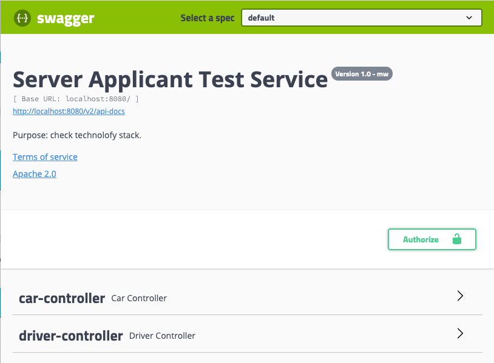

# Tools used

* Java 1.8
* Spring Boot
* Swagger
* Basic Authentication
* Filter by Example Criteria
* Database H2 (In-Memory)
* Maven

# How to run it

Main class: [ServerApplicantTestApplication.java](src/main/java/org/poc/ServerApplicantTestApplication.java )

Go to: http://localhost:8080

# How to authenticate/login
Authorization method used: Basic

### Using Swagger:
Click on Authorize button. 
- User: `user`
- Password: `password`


### Using curl:
```
curl  --user user:password 'http://localhost:8080/v1/drivers?onlineStatus=ONLINE'
```
